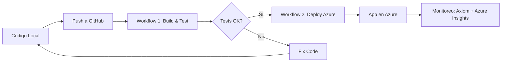

# 📋 Workflows del Proyecto - Guía para el Profesor

Este proyecto cuenta con **2 workflows principales** que cumplen con los requisitos de la materia.

---

## 🎯 Requisitos del Proyecto

1. ✅ **Construcción y Testing (Docker)**
2. ✅ **Despliegue Automatizado en Azure**

---

## 📂 Workflows Implementados

### 1️⃣ **Build and Test (Docker)**
**Archivo**: `.github/workflows/1-build-and-test.yml`

**Descripción**:
Workflow de Integración Continua (CI) que construye la imagen Docker y ejecuta tests automatizados de la API.

**Proceso**:
```
1. Checkout del código
2. Configurar Docker Buildx
3. Build de imagen Docker (vise-api:latest)
4. Levantar contenedor
5. Ejecutar tests con Hurl
6. Escaneo de seguridad con Trivy
7. Cleanup
```

**Cuándo se ejecuta**:
- ✅ Manualmente (workflow_dispatch)
- ✅ En cada push a main
- ✅ En cada pull request

**Cómo ejecutarlo**:
```
1. Ve a GitHub → Actions
2. Selecciona "1️⃣ Build and Test (Docker)"
3. Click en "Run workflow"
4. Ingresa el puerto (default: 3000)
5. Click en "Run workflow"
```

**Evidencias que genera**:
- ✅ Log de construcción de imagen Docker
- ✅ Resultados de tests de API
- ✅ Reporte de seguridad de la imagen

---

### 2️⃣ **Deploy to Azure**
**Archivo**: `.github/workflows/2-deploy-azure.yml`

**Descripción**:
Workflow de Despliegue Continuo (CD) que construye la imagen, la sube a Azure Container Registry y la despliega en Azure App Service.

**Proceso**:
```
JOB 1: Build and Push to ACR
  1. Checkout del código
  2. Login a Azure Container Registry
  3. Build de imagen Docker
  4. Push a ACR

JOB 2: Deploy to Azure App Service
  5. Deploy del contenedor a Azure
  6. Configurar variables de entorno

JOB 3: Test del deployment
  7. Esperar estabilización
  8. Test de conectividad
  9. Tests de API en Azure

JOB 4: Verificar monitoreo
  10. Confirmar logs en Axiom y Application Insights
```

**Cuándo se ejecuta**:
- ✅ Manualmente (workflow_dispatch)

**Cómo ejecutarlo**:
```
1. Ve a GitHub → Actions
2. Selecciona "2️⃣ Deploy to Azure"
3. Click en "Run workflow"
4. Parámetros:
   - IMAGE_REPOSITORY: api-vise
   - IMAGE_TAG: latest
   - AZURE_WEBAPP_NAME: vise-api-app
   - PORT: 443
5. Click en "Run workflow"
```

**Evidencias que genera**:
- ✅ Log de build y push a ACR
- ✅ Log de deployment en Azure
- ✅ Resultados de tests en producción
- ✅ URL de la aplicación desplegada

---

## 🚀 Flujo Completo de CI/CD

### Desarrollo Local → Testing → Azure



### Paso a Paso

1. **Desarrollar localmente** y hacer commit
2. **Push a GitHub**
3. **Ejecutar Workflow 1** (Build and Test)
   - Si los tests fallan → Fix code
   - Si los tests pasan → Continuar
4. **Ejecutar Workflow 2** (Deploy to Azure)
   - Build imagen
   - Push a ACR
   - Deploy a App Service
   - Tests en producción
5. **Verificar en Azure**: https://vise-api-app.azurewebsites.net
6. **Monitorear logs** en Axiom y Application Insights

---

## 📊 Tecnologías Utilizadas

### CI/CD
- **GitHub Actions** - Orquestación de workflows
- **Docker** - Containerización
- **Azure Container Registry (ACR)** - Registry de imágenes
- **Azure App Service** - Hosting

### Testing
- **Hurl** - Testing de APIs REST
- **Trivy** - Escaneo de seguridad de imágenes

### Monitoreo
- **Axiom** - Logs estructurados y análisis
- **Azure Application Insights** - Telemetría y APM

---

## 🔐 Secrets Requeridos en GitHub

Configura estos secrets en tu repositorio:
```
Settings → Secrets and variables → Actions → New repository secret
```

| Secret | Descripción | Uso |
|--------|-------------|-----|
| `ACR_NAME` | Nombre del Azure Container Registry | Build & Deploy |
| `ACR_PASSWORD` | Password del ACR | Build & Deploy |
| `AZURE_WEBAPP_PUBLISH_PROFILE` | Perfil de publicación del App Service | Deploy |

---

## ✅ Checklist de Entrega

Para demostrar al profesor que todo funciona:

### Workflow 1: Build and Test
- [ ] Ejecutar workflow manualmente
- [ ] Captura de pantalla del workflow en ejecución
- [ ] Captura de pantalla de tests pasando
- [ ] Captura de pantalla del reporte de seguridad

### Workflow 2: Deploy to Azure
- [ ] Ejecutar workflow manualmente
- [ ] Captura de pantalla del build y push a ACR
- [ ] Captura de pantalla del deployment exitoso
- [ ] Captura de pantalla de tests en Azure pasando
- [ ] URL de la aplicación funcionando

### Evidencias Adicionales
- [ ] Imagen en Azure Container Registry
- [ ] App Service corriendo en Azure Portal
- [ ] Logs en Axiom (https://app.axiom.co)
- [ ] Métricas en Application Insights

---

## 📸 Capturas de Pantalla Sugeridas

### Para el Workflow 1
1. GitHub Actions → Workflow "Build and Test" → Run exitoso
2. Logs mostrando: Docker build
3. Logs mostrando: Tests pasando con Hurl
4. Logs mostrando: Security scan

### Para el Workflow 2
1. GitHub Actions → Workflow "Deploy to Azure" → Run exitoso
2. Logs del job "Build and Push to ACR"
3. Logs del job "Deploy to Azure App Service"
4. Logs del job "Test deployment"
5. Azure Portal → App Service corriendo
6. Browser → App funcionando en https://vise-api-app.azurewebsites.net
7. Axiom → Logs recientes
8. Application Insights → Requests recientes

---

## 🎓 Explicación Técnica para el Profesor

### Separación de Workflows

**¿Por qué 2 workflows separados?**

1. **Workflow 1 (CI)**: Se enfoca en verificar que el código funciona
   - Rápido de ejecutar (~2-3 minutos)
   - Se puede ejecutar en cada push/PR
   - No consume recursos de Azure
   - Ideal para desarrollo iterativo

2. **Workflow 2 (CD)**: Se enfoca en desplegar a producción
   - Más lento (~5-10 minutos)
   - Solo se ejecuta manualmente o en main
   - Despliega a infraestructura real
   - Incluye tests de integración en Azure

**Ventajas de esta arquitectura**:
- ✅ Feedback rápido en desarrollo (CI)
- ✅ Deployment controlado a producción (CD)
- ✅ Separación de responsabilidades
- ✅ Fácil debugging (si falla CI, no llega a CD)
- ✅ Menor costo (no se despliega en cada commit)

---

## 📝 Notas Adicionales

### Otros Workflows en el Repositorio
El proyecto contiene otros archivos de workflow (test.yml, main.yml, mainazure.yml, etc.) que fueron versiones anteriores o de otros compañeros. Los workflows oficiales para este proyecto son:

- ✅ `1-build-and-test.yml`
- ✅ `2-deploy-azure.yml`

### Variables de Entorno en Azure
El App Service debe tener configuradas:
```
AXIOM_TOKEN=xaat-c3c5124b-b22a-4172-b701-2075ce260cc8
AXIOM_DATASET=vise-api-logs
NODE_ENV=production
PORT=3000
```

---

## 🌐 URLs del Proyecto

- **Aplicación en Azure**: https://vise-api-app.azurewebsites.net
- **Axiom Dashboard**: https://app.axiom.co
- **Azure Portal**: https://portal.azure.com
- **GitHub Repository**: [Tu URL de GitHub]

---

## 👥 Equipo

[Agrega aquí los nombres de los integrantes del equipo]

---

## 📅 Fecha de Entrega

[Agrega la fecha de entrega del proyecto]

---

**¿Preguntas?** Contacta a [tu email o información de contacto]
